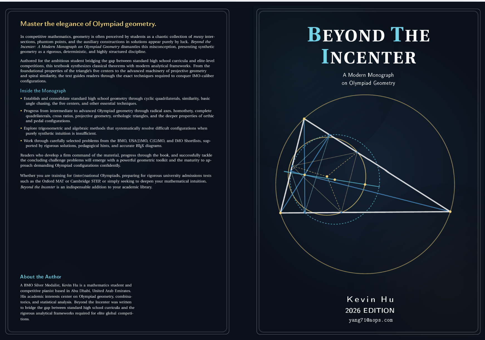

# Beyond the Incenter
### A Modern Monograph on Olympiad Geometry by Kevin Hu

**[Buy the Paperback on Amazon ➔](your-amazon-link)**

---

## About the Monograph
In competitive mathematics, geometry is often perceived by students as a chaotic collection of messy intersections, phantom points, and the auxiliary constructions in solutions appear purely by luck. *Beyond the Incenter* dismantles this misconception, presenting synthetic geometry as a rigorous, deterministic, and highly structured discipline.

Authored for the ambitious student bridging the gap between standard high school curricula and elite-level competitions, this textbook synthesizes classical theorems with modern analytical frameworks. From the foundational properties of the triangle’s five centers to the advanced machinery of projective geometry and spiral similarity, the text guides readers through the exact techniques required to conquer IMO-caliber configurations.

---

## Why I Wrote This Book: The Geometry Gap
If you read the official UKMT markers' reports over the last decade, a clear and recurring trend emerges. As explicitly noted in recent reports, geometry questions are consistently "one of the least attempted by candidates." When students do attempt them, markers lament that "it is far too common for candidates to show the algebraic proof with no reference to the geometrical justifications."

This is not just a statistical anomaly; it is a direct result of how mathematics is currently taught. Modern high school curricula have systematically phased out classical synthetic geometry in favor of coordinate methods. This creates a massive gap. When ambitious students encounter Olympiad-level geometry, they default to the only tools they have: Cartesian bashes and heavy trigonometry. As the markers' reports frequently note, this approach often leads to 90 minutes of messy algebra, a single sign error, and zero marks.

I saw this reality reflected in my own environment. In a school of over 1,000 students, I realized that only three of my peers had ever encountered Menelaus's Theorem, and exactly two knew how to utilize a complete quadrilateral. The standard curriculum simply does not equip students for elite competitions.

*Beyond the Incenter* was written to bridge this exact gap. While excellent resources exist for students already at the USAMO training camp level, I wanted to create a pedagogical stepping stone for everyone else. The goal of this monograph is not just to present difficult problems, but to replace the reliance on "lucky" auxiliary lines and brute-force algebra with a deterministic, analytical framework. By introducing students to the rigorous machinery of projective geometry, radical axes, and spiral similarity, the book aims to turn Olympiad geometry from a chaotic guessing game into a structured and highly logical discipline.

---

## Look Inside
To review the full Table of Contents, the pedagogical introduction, and the foundational theorems covered in Chapter 1, you can access the digital sample below.

**[Download the Sample Chapter (PDF) ➔](cross-ratios.pdf)**

---

## Errata & Updates
Mathematics is a collaborative and highly precise discipline. While this monograph has been meticulously proofread, minor typographical or logical errors may appear. A fully updated list of known errata is maintained below.

*There are currently no known errata in the First Edition (August 2026).*
